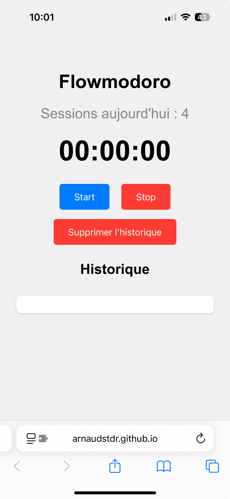

# Flowmodoro

Flowmodoro est une application web simple de gestion du temps inspirée de la méthode Pomodoro, conçue pour améliorer la productivité tout en favorisant des pauses régulières.

## Fonctionnalités

- **Démarrage, arrêt et réinitialisation d'une session de travail**
- **Calcul automatique du temps de pause** (1 min de pause toutes les 5 min de travail)
- **Historique des sessions** (stocké localement, effaçable)
- **Export de l'historique en CSV**
- **Compteur de sessions réalisées dans la journée**
- **Interface responsive et épurée**

## Utilisation

1. Cliquez sur "Start" pour démarrer une session de travail.
2. Cliquez sur "Stop" pour terminer la session et enregistrer la tâche.
3. Suivez la durée de pause recommandée.
4. Consultez ou exportez l'historique de vos sessions.

## Installation

Aucune installation requise :

- Ouvrez simplement le fichier `index.html` dans votre navigateur.

## Technologies

- HTML5, CSS3, JavaScript (Vanilla)
- Stockage local via `localStorage`

## Capture d'écran

## Licence

Ce projet est sous licence MIT.

---

*Développé par Arnaud Stadler.*
